# Ejercicio 2: Docker Compose

<!-- MarkdownTOC -->

- [Descripción de la práctica](#descripción-de-la-práctica)
- [Servicios de Azure empleados](#servicios-de-azure-empleados)
- [Elementos necesarios para la realización de la práctica](#elementos-necesarios-para-la-realización-de-la-práctica)
  - [Creación del grupo de recursos](#creación-del-grupo-de-recursos)
  - [Creación del Azure Container Registry](#creación-del-azure-container-registry)
  - [Imágenes Docker utilizadas](#imágenes-docker-utilizadas)
  - [Fichero docker-compose.yml](#fichero-docker-composeyml)
  - [Despliegue: creación y configuración del App Service](#despliegue-creación-y-configuración-del-app-service)

<!-- /MarkdownTOC -->

## Descripción de la práctica

Esta práctica consiste en el despliegue, utilizando [Docker Compose](https://docs.docker.com/compose/), de una aplicación multicontenedor. La aplicación está compuesta por dos servicios, una base de datos SQL y un _front-end_ expuesto públicamente. Estos recursos serán desplegados en [Microsoft Azure](https://azure.microsoft.com/en-us/), empleando para ello los servicios necesarios que nos ofrece la plataforma.

## Servicios de Azure empleados

Los servicios de Azure necesarios para esta práctica son los siguientes:

- [Azure App Service](https://learn.microsoft.com/en-us/azure/app-service/overview), para desplegar la aplicación dockerizada utilizando docker-compose (esta funcionalidad todavía se encuentra en una versión preliminar). Este servicio obliga a la creación de un [Azure App Service plan](https://learn.microsoft.com/en-us/azure/app-service/overview-hosting-plans) en caso de que no exista un plan creado con anterioridad.
- [Azure Container Registry](https://learn.microsoft.com/en-us/azure/container-registry/container-registry-intro), para almacenar las imágenes Docker necesarias para el despliegue
- [Azure Resource Groups](https://azurelessons.com/what-is-resource-group-in-azure/#What_is_resource_group_in_Azure), para agrupar todos los recursos necesarios para la realización de la práctica.

Se ha utilizado [Azure CLI](https://learn.microsoft.com/en-us/cli/azure/) en local. Si se desea, en su lugar, se puede utilizar el servicio [Azure CloudShell](https://learn.microsoft.com/en-us/azure/cloud-shell/overview).

## Elementos necesarios para la realización de la práctica

### Creación del grupo de recursos

Para agrupar los recursos que conformarán esta práctica, se crea un grupo de recursos con el siguiente comando:

```bash
az group create --name ics-ej2 --location "West Europe"
```

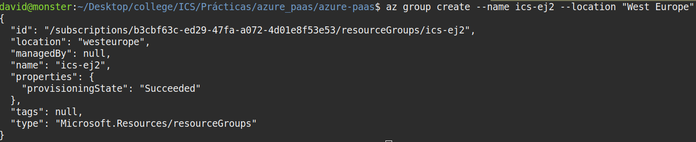

### Creación del Azure Container Registry

Para almacenar las imágenes personalizadas, se crea un _container registry_. Para crear uno, se ejecutan los siguientes comandos:

```bash
az acr create --name icsej2containeregistry
--resource-group ics-ej2 --sku Basic
```

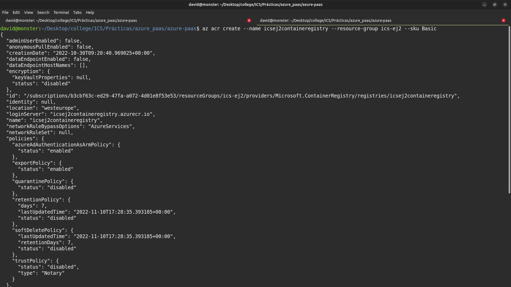

Además, se habilita el usuario admin con el siguiente comando:

```bash
az acr update -n icsej2containeregistry --admin-enabled true
```

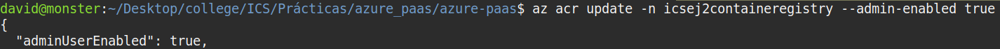

### Imágenes Docker utilizadas

Las imágenes Docker utilizadas como base para está práctica, obtenidas de Docker Hub, son las siguientes:

- [mysql:5.7](https://hub.docker.com/layers/library/mysql/5.7/images/sha256-64dc581e69a2e37825c4f669c2c5903f258d8fca529632c73c5e7c8095432c04?context=explore)
- [wordpress:latest](https://hub.docker.com/layers/library/wordpress/latest/images/sha256-63c4100a4cd06c82ea824ede6f07f2a0f0a3bba6983dc9ccdaa573e3c9dfadc1?context=explore)

Se ha generado un tag para cada una de las imágenes, de forma que ahora apunten al ACR generado, y se han subido las imágenes al mismo. Los comandos para generar las imágenes y subirlas al ACR son las siguientes:

```bash
docker pull mysql:5.7
docker pulk wordpress:latest

# Comando interactivo, hay que añadir las credenciales necesarias
# Home > Resource groups > ics-ej2 > icsej2containeregistry
# Username: icsej2containeregistry
# Password: incluir el contenido de password o password2
docker login icsej2containeregistry.azurecr.io

docker tag mysql:5.7 icsej2containeregistry.azurecr.io/mysql:5.7
docker tag wordpress:latest
icsej2containeregistry.azurecr.io/wordpress:latest

docker push icsej2containeregistry.azurecr.io/mysql:5.7
docker push icsej2containeregistry.azurecr.io/wordpress:latest
```

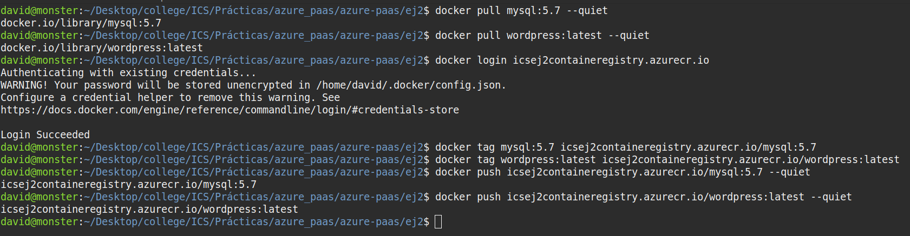

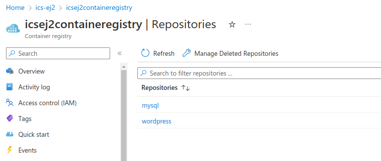

### Fichero docker-compose.yml

```yaml
---
services:
  mysql:
    image: icsej2containeregistry.azurecr.io/mysql:5.7
    restart: always
    volumes:
      - ${WEBAPP_STORAGE_HOME}/site/data:/var/lib/mysql
    environment:
      MYSQL_ROOT_PASSWORD: toor
      MYSQL_DATABASE: ics-ej2
      MYSQL_USER: dfr
      MYSQL_PASSWORD: dfr

  wordpress:
    image: icsej2containeregistry.azurecr.io/wordpress:latest
    depends_on:
      - mysql
    ports:
      - "80:80"
    restart: always
    volumes:
      - ${WEBAPP_STORAGE_HOME}/site/wwwroot:/var/www/html
    environment:
      WORDPRESS_DB_HOST: mysql:3306
      WORDPRESS_DB_NAME: ics-ej2
      WORDPRESS_DB_USER: dfr
      WORDPRESS_DB_PASSWORD: dfr
```

El fichero `docker-compose.yml` se compone de dos servicios, `mysql` y `wordpress`, para configurar la BBDD y la página web, respectivamente. 

En el servicio de `wordpress` se ha abierto el puerto 80 para poder acceder a la página web. Además, se ha incluido la directiva `depends_on` para controlar el orden de inicio (`mysql -> wordpress`) y apagado (`wordpress -> mysql`) de los servicios 

Se han configurado dos volúmenes para persistir los datos de la BBDD y los contenidos de la página web. Se puede ver, a través de un cliente FTP, los datos que se están persistiendo. Además de esto, se debe añadir la configuración `WEBSITES_ENABLE_APP_SERVICE_STORAGE` (ver la sección [Creación y configuración del App Service](#creacion-y-configuracion-del-app-service)) a `true` en el App Service 

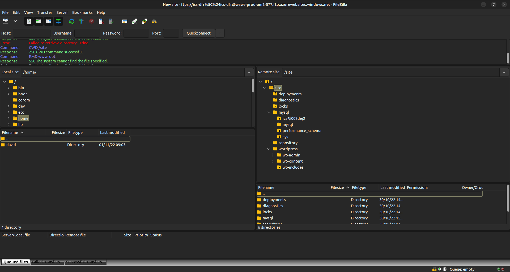

Ambos servicios cuentan con la siguiente configuración de entorno:

- `mysql`:
  + `MYSQL_ROOT_PASSWORD`: contraseña del usuario `root` de la BBDD
  + `MYSQL_DATABASE`: nombre de la BBDD inicial, que se utiliza para la página web
  + `MYSQL_USER`: usuario de mysql
  + `MYSQL_PASSWORD`: contraseña del usuario `MYSQL_USER`

- `wordpress`:
  + `WORDPRESS_DB_HOST`: dirección de la BBDD utilizada. En el contexto del docker-compose, se puede utilizar el nombre del servicio de BBDD (`mysql`) como referencia. El [puerto por defecto de MySQL](https://dev.mysql.com/blog-archive/mysql-guide-to-ports/) es el 3306.
  + `WORDPRESS_DB_NAME`: nombre de la BBDD. Se utiliza la definida en `MYSQL_DATABASE`
  + `WORDPRESS_DB_USER`: usuario de la BBDD. Debe ser el mismo que el definido en `MYSQL_USER`
  + `WORDPRESS_DB_PASSWORD`: contraseña del usuario `WORDPRESS_DB_USER`

### Despliegue: creación y configuración del App Service

Para la creación del App Service se requiere un App Service Plan, que define el tipo de recursos utilizados para la ejecución de las aplicaciones. Los comandos para crear el App Service y su plan asociado son:

```bash
az appservice plan create --name ASP-icsej2-a972 --resource-group
ics-ej2 --sku S1 --is-linux

az webapp create --resource-group ics-ej2 --plan ASP-icsej2-a972 
--name ics-dfr --multicontainer-config-type compose
--multicontainer-config-file docker-compose.yml
```

En las siguientes imágenes se crea tanto el App Service Plan como el App Service asociado a dicho plan.

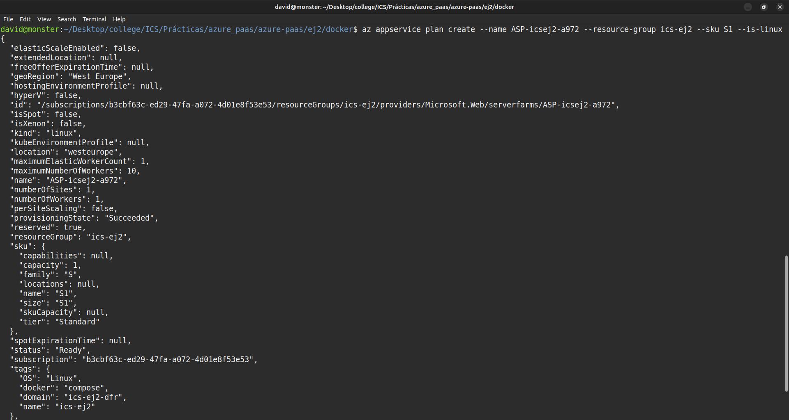

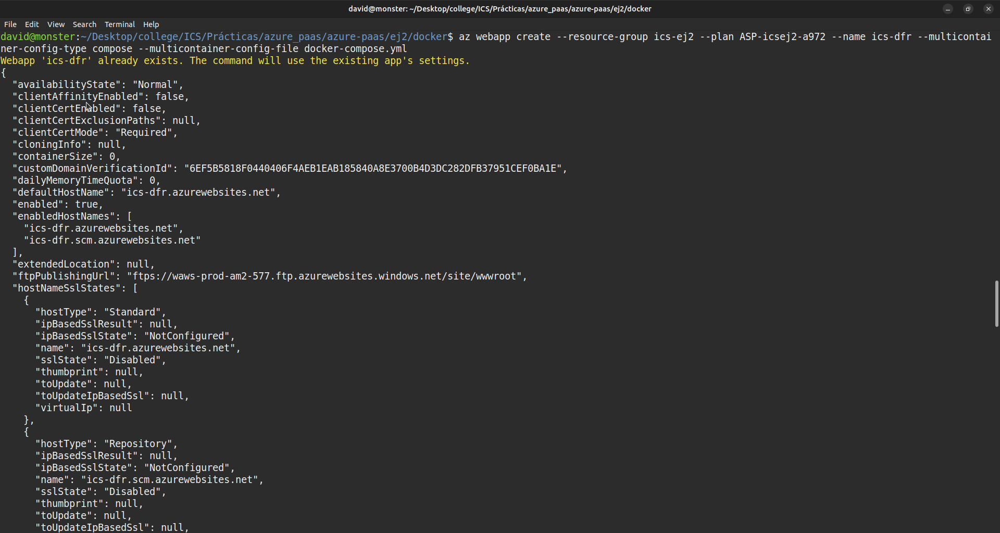

Para configurar el acceso a ACR, se deben añadir las credenciales de acceso como configuración al App Service. Para ello, se ejecutarán los siguientes comandos:

```bash
az webapp config appsettings set --resource-group ics-ej2
--name ics-dfr --settings DOCKER_REGISTRY_SERVER_URL=
"https://icsej2containeregistry.azurecr.io"

az webapp config appsettings set --resource-group ics-ej2
--name ics-dfr --settings DOCKER_REGISTRY_SERVER_USERNAME=
"icsej2containeregistry"

az webapp config appsettings set --resource-group ics-ej2
--name ics-dfr --settings DOCKER_REGISTRY_SERVER_PASSWORD=
<registry_password>
```

Debido a una [issue](https://github.com/MicrosoftDocs/azure-docs/issues/47070) con este servicio, para configurar la persistencia, se debe de añadir la variable `WEBSITES_ENABLE_APP_SERVICE_STORAGE` en la configuración y fijar su valor a `true`, ya que esta no está definida por defecto. Para añadir dicha configuración se ejecuta el siguiente comando:

```bash
az webapp config appsettings set --resource-group ics-ej2
--name ics-dfr --settings
WEBSITES_ENABLE_APP_SERVICE_STORAGE=TRUE
```

La configuración final del App Service es la siguiente:

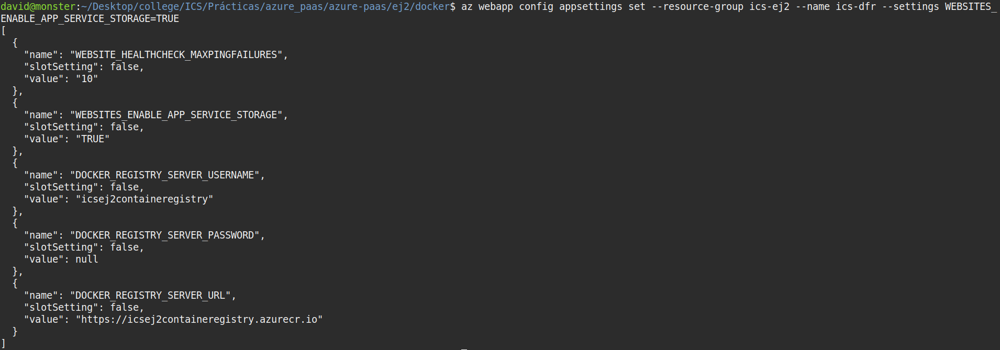

Esta es la vista desde la interfaz web de la configuración de 

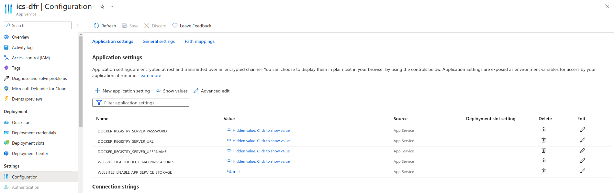

NOTA: la variable `WEBSITE_HEALTHCHECK_MAXPINGFAILURES` no es necesaria. Se incluye automáticamente al configurar el [healthcheck](https://learn.microsoft.com/en-us/azure/app-service/monitor-instances-health-check?tabs=dotnet) de la aplicación. Adicionalmente, la siguiente imagen muestra dicha configuración del _healthcheck_ para este App Service. Se puede ver que el valor de la variable coincide con el valor de _Load balancing threshold_

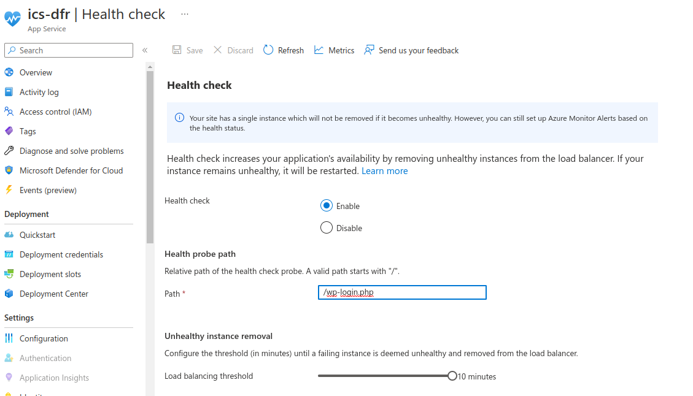

Para monitorizar el despliegue de la aplicación, es posible consultar los logs que Docker Engine genera. Es posible consultarlos desde la interfaz web (App Service -> Deployment -> Deployment Center -> Logs)

(Añadir foto dos logs da última ejecución cando haxa que entregar)

Finalmente y una vez ha terminado el despliegue, la primera vez que accedamos a la [dirección](https://ics-dfr-azurewebsites.net/) donde se encuentra alojada la aplicación, se iniciará el proceso de instalación de Wordpress. Como se han configurado los datos de conexión con la BBDD en el docker-compose, esa parte de la instalación no será necesario realizarla.
